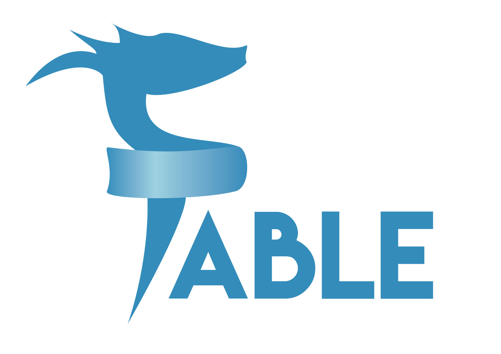
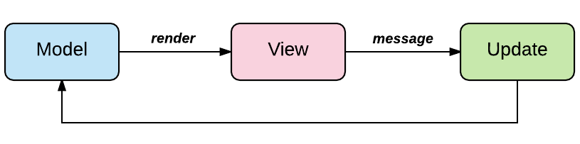
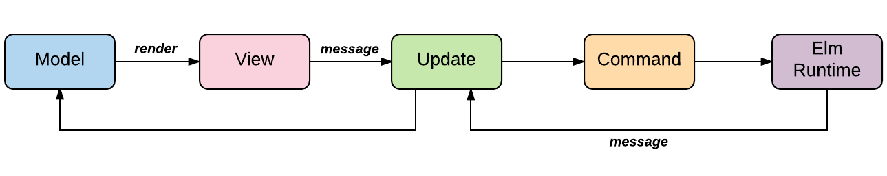
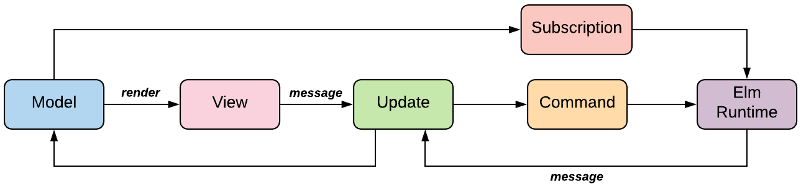

name: inverse
layout: true
class: center, middle, inverse
---
# Reactive programming with F# and Fable Elmish
## <jonas.juselius@itpartner.no>
### https://github.com/juselius
### https://twitter.com/copointfree

---
layout: false
## Compiling F# to JavaScript
.left-column[
## Fable
.left[]
]
.right-column[
* [Fable](http://fable.io) is an F# to JavaScript compiler powered by Babel.
* It's designed to produce readable and standard code.
* Fable brings all the power of F# to the JavaScript ecosystem.
    * Static typing with type inference
    * Exhaustive pattern matching
    * Immutability by default
    * Structural equality or units of measure
    * And much more
]

---
## .NET Core templates
.left-column[
## Fable
### About
### Fable.Template
]
.right-column[
Scaffold a simple Fable SPA:
```sh
dotnet new -i fable.template
dotnet new fable -n FableApp -o FableApp
cd FableApp
.paket/paket.exe install
yarn install
yarn run start
```
(currently broken for Fable 2.0)
]

---
## .NET Core templates
.left-column[
## Fable
### About
### Fable.Template
### SAFE.Template
]
.right-column[

Scaffold a client-server application using the SAFE template:

```sh
dotnet new -i safe.template
dotnet new  safe -n SafeApp -o SafeApp -c remoting -d docker
cd SafeApp
.paket/paket.exe install
yarn install
cd Server; dotnet run
cd src/Client
dotnet restore
dotnet fable webpack-dev-server -- \
  --config src/Client/webpack.config.js
```
]

---
## The Elm architecture

* The Model-View-Update (MVU) architecture is a simple way to create reactive
  applications
* First invented and popularized by Elm (Evan Czaplicki)
* No explicit *mutable state*
* **Everything** happens through *messages* and *commands*
* Related to the *actor model*
* Excellent fit for functional programming
* Fable.Elmish is 251 lines of code in total

---
## Model-View-Update
.center[]

---
## Model-View-Update-Command
.center[]

---
## Model-View-Update-Command-Subscription
.center[]

---
## Elmish implementation
```fsharp
let runWith (arg: 'arg) (program: Program<'arg, 'model, 'msg, 'view>) =
    let (model,cmd) = program.init arg
    let inbox = MailboxProcessor.Start(fun (mb:MailboxProcessor<'msg>) ->
        let rec loop (state:'model) =
            async {
                let! msg = mb.Receive()
                let newState =
                    try
                        let (model',cmd') = program.update msg state
                        program.setState model' mb.Post
                        cmd' |> Cmd.exec mb.Post
                        model'
                    with ex ->
                        program.onError ("Unable to process a message:", ex)
                        state
                return! loop newState
            }
        loop model
    )
    program.setState model inbox.Post
    let sub =
        try
            program.subscribe model
        with ex ->
            program.onError ("Unable to subscribe:", ex)
            Cmd.none

```

---
.left-column[
## Combinators
]
.right-column[
* The word *combinator* is used for functions which are designed to be combined
  in various flexible ways
* (In lambda calculus it's a function with no *free* variables)
* Often used to create *embedded domain specific languages* (EDSL)
* Examples are: HTML and parser combinators
]

---
.left-column[
## Combinators
### Elmish.React
]
.right-column[

The Elmish.React combinator library defines functions for *every* html tag, with
the following signature:
```fsharp
val elem: seq<IHTMLProp> -> seq<ReactElement> -> ReactElement
```

For example:
```fsharp
div [] [
    h1 [] [ str "Hello World!" ]
    p [] [
        ul [] [
           li [] [ str "foo" ]
           li [] [ str "bar" ]
        ]
    ]
    br [] []
]
```
]

---
.left-column[
## Combinators
### Elmish.React
### Elmish.React.Props
]
.right-column[
The Elmish.React.Props module contains combinators for html attributes:

```fsharp
div [ Id "main" ] [
    h1 [ FontSize "30px" ] [ str "Hello World!" ]
    p [ Style [ CSSProp.BackgroundColor "green" ] ] [
       ul [] [
          li [ OnClick (fun ev -> console.log "foo") ]
             [ str "foo" ]
          li [] [ str "bar" ]
       ]
    ]
]
```
]

---
.left-column[
## Combinators
### Elmish.React
### Elmish.React.Props
### Fulma
]
.right-column[
* Using HTML and CSS directly is quite low level and primitive, not to say
  inefficient
* [Bootstrap](https://getbootstrap.com) is a popular high-level CSS framework
* [Bulma](https://bulma.io) is another popular, modern CSS framework
* [Fulma](https://mangelmaxime.github.io/Fulma/) is an EDSL built around Bulma.
* Fulma provides higher-level html combinators:
  * Layout: Container, Columns, Title, Foooter
  * Elements: Box, Button, Content, Form, Table, Progress
  * Compoents: Breadcrumb, Card, Dropdown, Navbar, Modal, Panel, Tabs
  * And much more
* Fulma and Elmish.React can be freely mixed, similar type signatures
* Fulma has many submodules, with "internal" type signatures
]

---
.left-column[
## Combinators
### Elmish.React
### Elmish.React.Props
### Fulma
### Fulma example
]
.right-column[
```fsharp
Panel.panel [] [
    Content.content [] [
        Button.button [
           Button.Color IsDanger
           Button.OnClick (fun _ -> console.log "hello")
        ] [ str "Say hello" ]
    ]
]

```
]

---
## Odds and ends
* Time-traveling debugger
* Saturn
* Cordova
* React Native


